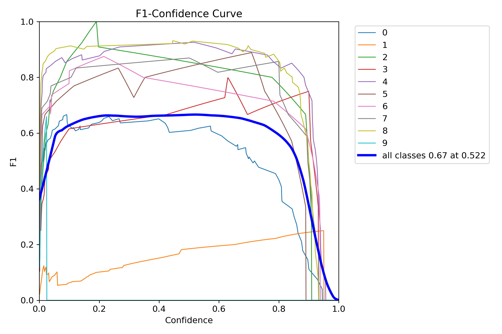
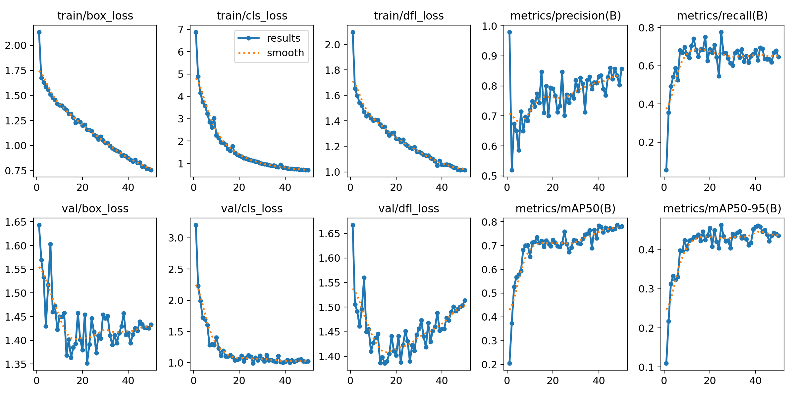

# OPG Dental Scan Object Detection Model

## Description

This project uses YOLOv8 to detect dental findings in Orthopantomography (OPG) X-rays:

- Broken Roots
- Periodontally Compromised Teeth (PCT)  
- Edentulous Spaces (for K-Classification)

## Dependencies

- Python 3.7
- Ultralytics (YOLOv8)
- OpenCV-Python




## Project Structure

```text
./                     # Root directory
├── model/            # YOLOv8 model (.pt file)
├── app.py           # Flask inference server
└── requirements.txt # Dependencies
```

## Setup

1. Install dependencies:
    ```bash
    pip install -r requirements.txt and build a virtual environment 
    ```

2. Add model file:
    - Place YOLOv8 weights (`best.pt`) in `model/` directory
    - Update `MODEL_PATH` and `IMAGE_SIZE` in `app.py`

## Usage

1. Navigate to project directory
2. Start Flask server:
    ```bash 
    python app.py
    ```
3. Access web interface at `http://127.0.0.1:5000/`


